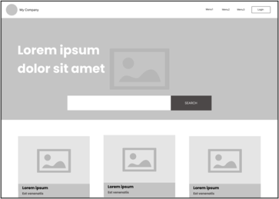
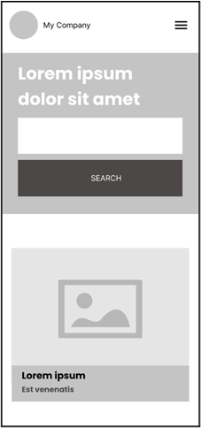

# Mission 0

[](https://black-cliff-07962791e.5.azurestaticapps.net/)

## Overview

Welcome to Mission0! This is a missionready level 5 mission0. The project is built using modern web technologies as react and is hosted on Azure Static Web Apps.

## Table of Contents

- [Installation](#installation)
- [Usage](#usage)
- [Features](#features)
- [Technologies Used](#technologies-used)
- [Contributing](#contributing)
- [License](#license)

## Installation

To set up this project locally, follow these steps:

1. Clone the repository:
    ```sh
    git clone https://github.com/MatiasvMissionReadyHq/mission0.git
    ```
2. Navigate to the project directory:
    ```sh
    cd your-repo-name
    ```
3. Install dependencies:
    ```sh
    npm install
    ```
4. Start the development server:
    ```sh
    npm start
    ```

## Usage

To use the project, simply visit [https://black-cliff-07962791e.5.azurestaticapps.net/](https://black-cliff-07962791e.5.azurestaticapps.net/).

### Screenshots





## Features

- Feature 1
- Feature 2
- Feature 3

## Technologies Used

- React
- Azure Static Web Apps
- css modules

## Contributing

Contributions are welcome! Please follow these steps to contribute:

1. Fork the repository.
2. Create a new branch:
    ```sh
    git checkout -b feature/your-feature-name
    ```
3. Make your changes.
4. Commit your changes:
    ```sh
    git commit -m 'Add some feature'
    ```
5. Push to the branch:
    ```sh
    git push origin feature/your-feature-name
    ```
6. Open a pull request.

## License

This project is licensed under the [License](LICENSE).

## Contact

If you have any questions, feel free to reach out:

- [Matias Pereyra](mailto:matiasv@missionreadyhq.com)
- [GitHub](https://github.com/MatiasvMissionReadyHq)
